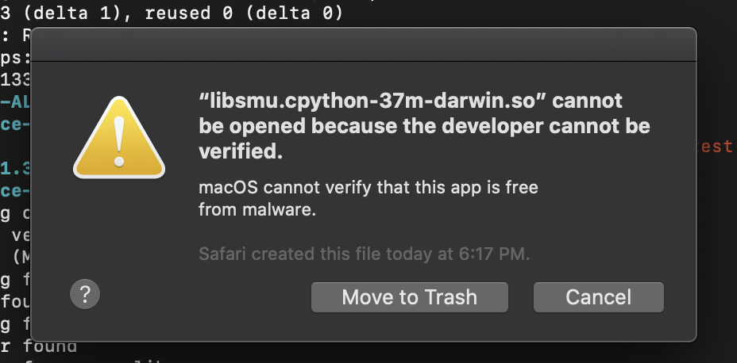
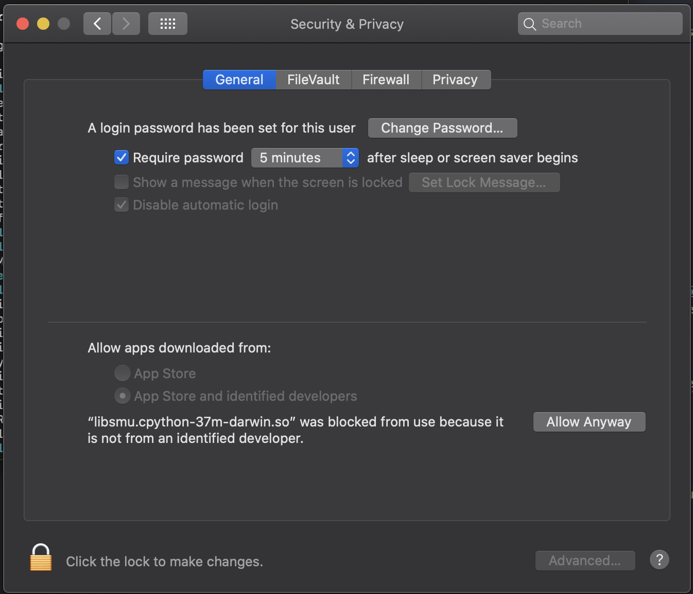
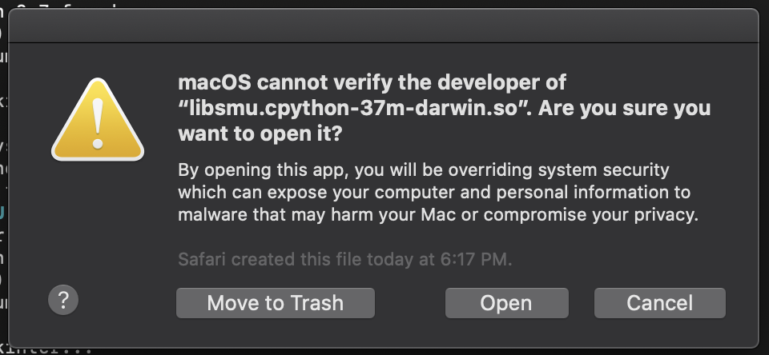

# Purpose
This document is a short guide on how to install alice for use with the Analog Devices M1000 board on macOS. Support for macOS with alice 1.3 is limited and the installation procedure provided from Analog Devices is spotty and unclear.  

## Download and Install libsmu-1.0.2
Go to https://github.com/analogdevicesinc/libsmu/releases and  download libsmu-1.0.2-darwin-{OS X}.pkg where {OS X} is the version of OS X your computer is running. Locate the downloaded .pkg in Finder and control-click it. Choose open. A warning will probably pop up saying that macOS cannot verify the developer. Click "open".
Follow the installation procedure.

## Install dependencies
Check if python3 is installed by opening the terminal and issuing the following command

```python3 --version```

If you see something like 'command not found: python3', use brew to install python3

```brew install python3```

Now install 'libusb' using brew

```brew install libusb```

Use pip3 (python's package installer) to install numpy and tk

```pip3 install numpy tk```

## Download alice
Download the package from [here](https://canvas.ucdavis.edu/courses/475222/files/folder/Course%20Software/Alice%20Suite%20for%20ALALM1000). In the future, alice will be launched from this directory so remember where you saved it.

## Install alice
Plug in the M1K. Open the terminal and cd to where you downloaded alice. Once in this directory, run

```./test.sh```

If you're using Catalina, you'll get a pop-up that says the package is from an unverified developer.



Click cancel. Now open "System Preferences > Security and Privacy > General". You'll see a notice that 'libsmu.cpython-37m-darwin.so' was blocked.



Click "Allow Anyway".
Go back to your terminal and re-run

```./test.sh```

You'll get another pop-up, but this time you will be able to click 'open'.



A similar error to the first one will pop-up, follow the same procedure as above to allow the other app to be opened.

If installation was successful, `Python configuration appears to be OK.  Good luck running Alice!` will have been printed to the terminal. Re-run the test script again...

```./test.sh```

The program should now run. If this is the first time the M1K has been connected to a computer, it may need its firmware updated. The latest firmware can be downloaded [here](https://github.com/analogdevicesinc/m1k-fw/releases/tag/v2.1). Just upload the .bin to alice when prompted.
